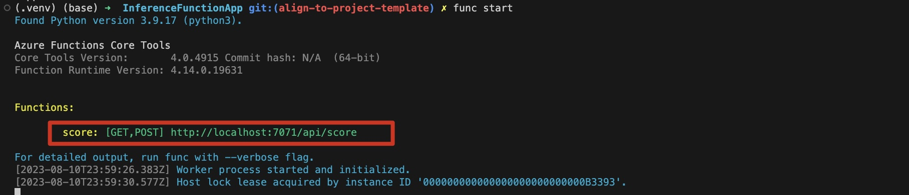

<!--
SPDX-FileCopyrightText: 2023 Adam Wojdyła <adam.wojdyla@outlook.com>

SPDX-License-Identifier: MIT
-->

# Quick guide

## Project Structure

The main project folder (FunctionApp) can contain the following files:

* **local.settings.json** - Used to store app settings and connection strings when running locally. This file doesn't get published to Azure. To learn more, see [local.settings.file](https://aka.ms/azure-functions/python/local-settings).
* **requirements.txt** - Contains the list of Python packages the system installs when publishing to Azure.
* **host.json** - Contains global configuration options that affect all functions in a function app. This file does get published to Azure. Not all options are supported when running locally. To learn more, see [host.json](https://aka.ms/azure-functions/python/host.json).
* **.vscode/** - (Optional) Contains store VSCode configuration. To learn more, see [VSCode setting](https://aka.ms/azure-functions/python/vscode-getting-started).
* **.venv/** - (Optional) Contains a Python virtual environment used by local development.
* **Dockerfile** - (Optional) Used when publishing your project in a [custom container](https://aka.ms/azure-functions/python/custom-container).
* **tests/** - (Optional) Contains the test cases of your function app. For more information, see [Unit Testing](https://aka.ms/azure-functions/python/unit-testing).
* **.funcignore** - (Optional) Declares files that shouldn't get published to Azure. Usually, this file contains .vscode/ to ignore your editor setting, .venv/ to ignore local Python virtual environment, tests/ to ignore test cases, and local.settings.json to prevent local app settings being published.

Each function has its own code file and binding configuration file ([**function.json**](https://aka.ms/azure-functions/python/function.json)).

## Prerequisites

* Python 3.7-3.10
* pip (package installer for Python)
* virtual environment
* Azure Functions Core Tools
* Python VSC extension
* Azure Functions VSC extension
* Azurite VSC extension

## How to start

1. Configure local environment: [more info](https://learn.microsoft.com/en-us/azure/azure-functions/create-first-function-vs-code-python?pivots=python-mode-decorators)

2. Go to Inference project

    ```bash
    cd InferenceFunctionApp
    ```

3. Install requirements

    ```bash
    python3 -m venv .venv
    source .venv/bin/activate
    pip install -r requirements.txt
    ```

    *Note: Installing torch==1.13.0+cpu and torchvision==0.14.0+cpu might fail on some systems. Then, delete the torch dependency from requirements.txt, reinstall requirements and manually install the normal torch package using script below*

    ```bash
    pip install torch==1.13.0
    pip install torchvision==0.14.0
    ```

4. Type in terminal `func start` or run with VSC debugger

    *Note - launch.json file for debugging should be created automatically by azure fucntions core tools, otherwise copy the below configuration*

    ```json
        {
            "version": "0.2.0",
            "configurations": [
                {
                    "name": "Attach to Python Functions",
                    "type": "python",
                    "request": "attach",
                    "port": 9091,
                    "preLaunchTask": "func: host start"
                }
            ]
        }
    ```

5. Function should start on localhost:7071
  
6. Import postman [collection](../Postman/AITech-flats.postman_collection.json) and try out the API. The input image should be in base64 format. The result will be a json object with predictions of interior styles for image passed in request
  


## Additional documentation

1. Azure Functions Python developer guide [link](https://learn.microsoft.com/en-us/azure/azure-functions/functions-reference-python?tabs=asgi%2Capplication-level&pivots=python-mode-decorators)
2. Create and run Azure Functions locally by using the Core Tools [link](https://learn.microsoft.com/en-us/training/modules/develop-test-deploy-azure-functions-with-core-tools/2-create-run-functions-locally-core-tools)
3. Debugging azure functions locally in VSC [link](https://swaminathanvetri.in/2020/02/07/debugging-azure-functions-locally-in-vs-code/)
4. Azure functions core tools [link](https://learn.microsoft.com/en-us/azure/azure-functions/functions-develop-vs-code?tabs=csharp)


